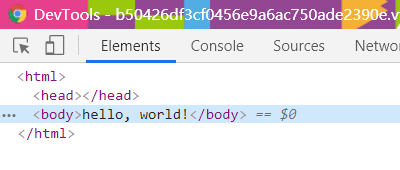
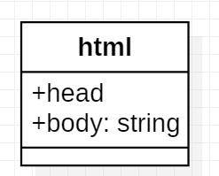
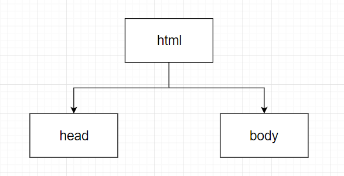
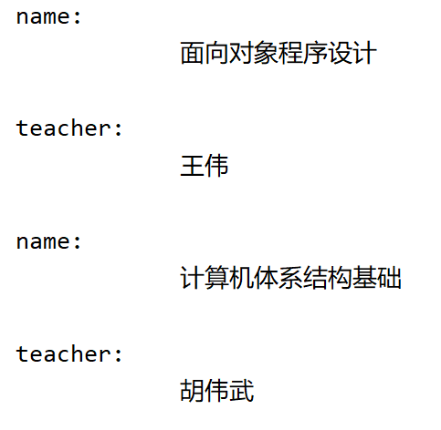

# 0. 相关名词简介

## XML

XML意为extensible markup language，即可扩展标记语言。它与HTML类似，但是不同之处在于，XML 被设计用来传输和存储数据，其焦点是数据的内容；而HTML 被设计用来显示数据，其焦点是数据的外观 。XML的主要应用领域在Web开发方面，常常用于简化数据的存储和共享。

XML是可扩展的，因此用户可以创建自己的适合应用程序的自描述标签或者语言； XML承载数据，但是不实现它，也就是说，XML 并不具备成为一种编程语言的资格，因为它不执行任何计算或者算法，只是通常存储在简单的文本文件中，并通过能够解释 XML 的特殊软件处理。

下面先从一个html格式的网页说起


上图是我在软件工程课上面用ruby on rails写的一个hello\_world的页面，如上图所示。如果使用F12去审查此页面的元素就可以得到如下的结果：



这个就是HTML的格式。可以看到这个结构类似于一个对象，”对象“名叫html，具有head和body的属性，这里由于是空页面，因此head为空，而body就是很简单的hello，world文字。如果改成UML类图的话，就类似于：



这个hello world 页面就是html类的一个实例，head为空字符，body为字符串”hello，world“

如果将这个结构根据缩进以及标签的层次关系，理解为主从关系的话，绘制成节点的形式，就是这样的：



上面的树状结构表现了“属性”和“类”之间的结构关系。基于这样的关系，我们把html叫做此HTML文件的根元素

一个XML格式的文件和上面的类似，比如说如下：


如上的代码中创建了2个“课程”类的实例，实例的属性包括课程名称以及授课老师2项，根元素为classes。对于XML格式来说，一个XML文件只能有1个根元素

由于XML基于一定的文法进行格式化的数据存储，因此为了从XML文件中提取出有效的信息并过滤掉无用的信息，需要对XML文件进行解析。解析XML的方式有DOM、PULL、SAX等，本文讨论的dom4j是基于DOM与SAX的方式设计的。

## DOM

DOM，全称为Document Object Model，即文档对象模型，它是HTML和XML文档的编程接口。它提供了对文档的结构化的表述，并定义了一种方式，使得程序可以对该结构进行访问，从而改变文档的结构、样式和内容。

DOM 将文档解析为一个由节点和对象（包含属性和方法的对象）组成的结构集合。它首先读取整个XML文件，然后基于文件给XML文件构建出一个树形结构，创建完毕之后再使用DOM定义的API去访问树结构的各个部位，以检索想要的数据以及对数据进行修改。

## SAX

SAX，全称为simple API for XML，与DOM不同的是，SAX基于事件驱动，在读取XML文档内容时，事件源顺序地对文档进行扫描，而不是创建一棵解析树。

由于SAX是类似于“临时解析”的方法，较与DOM，它的解析效率高、占存少、灵活性高，但是解析方法复杂（API接口复杂），可拓展性差，而且最重要的是，无法对 XML 树内容结构进行任何修改。

## dom4j

dom4j，全称为Document Object Model for Java，是一个java的开源XML解析包。dom4j允许用户读\(Read\)、写\(Write\)、浏览\(Navigate\)、创建\(Create\)以及修改\(Modify\) XML文件。

DOM是一个与具体的语言无关的大型API，而dom4j是一个基于DOM基础在Java上实现的轻量级的API，或者说是一个Java类包。dom4j支持DOM的标准，使得DOM的API使用更为便捷。

使用dom4j的解析器去解析上面创建的xml文件，代码如下所示：

```java
package test_dom4j;

import java.io.File;
import java.util.List;

import org.dom4j.Document;
import org.dom4j.Element;
import org.dom4j.io.SAXReader;

public class d4jdriver
{
    public static void main(String[] args) throws Exception
    {
        SAXReader reader = new SAXReader();
        File myfile = new File("D:\\coding\\java_practice\\src\\test_dom4j\\test1.xml");
        Document doc = reader.read(myfile);
        Element root = doc.getRootElement();
        List<Element> child = root.elements();
        for(Element e: child)
        {
            System.out.println("name: " + e.elementText("name"));
            System.out.println("teacher: " + e.elementText("teacher"));
        }
    }
}
```

上面的代码的步骤就是，首先导入对应的包以完成相应操作。然后在main函数里面先实例化一个SAXReader（此类即为dom4j包里面的一个类），然后读取xml文件，将文件转化为Document类型，然后读取document类型里面的根目录（本例里面即为classes\)，然后根据根目录将里面的元素转化为list，最后用循环的方式打印list里面的各个元素。打印出的结果如下所示：




