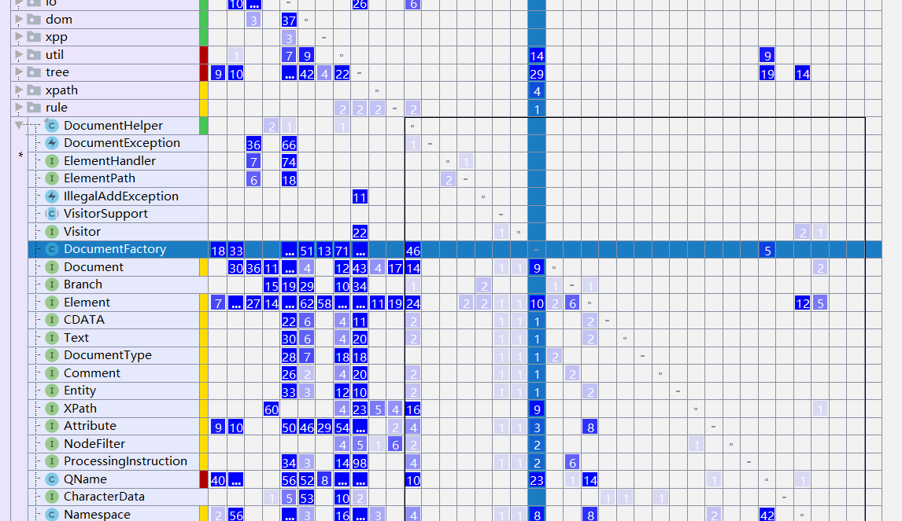
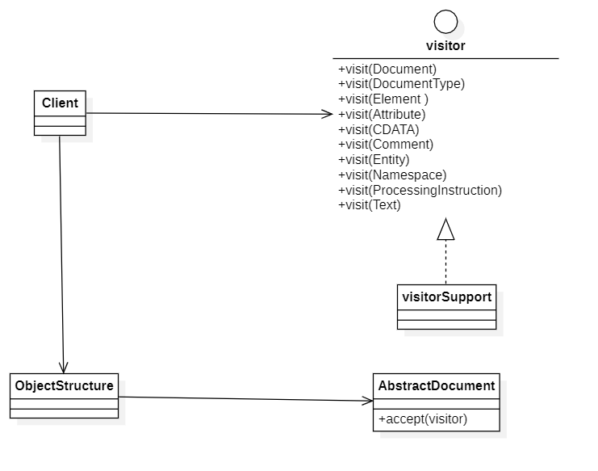

# 1. 功能分析与建模

## 建立需求模型

### 第一步：正常处理（normal）

根据[dom4j.github.io](https://dom4j.github.io/)所提供的示例代码，列举出下述3种常见的用例：

```text
【用例名称】
	1. 解析xml格式的文件
【场景】
	who：xml文件，dom4j的xml解析器
	when：调用相关函数时
	where：内存空间中
【用例描述】
	0.导入dom4j的包
	1.创建一个SAXReader类的实例
	2.打开某个xml文件或从数据流那里创建一个Document类的实例
	3.从Document实例中提取出xml格式的Element类型的元素
		3.1.获取根元素
		3.2.通过根元素递归地获得叶子元素
		3.3.获得List类型的元素列表
	4.通过ELement类型的某些方法获取类型的各个属性
【用例价值】
	以面向对象的方式提取出XML格式文件的关键信息
【约束和限制】
	1.被解析的文件必须符合XML的格式
	2.调用dom4j包以及编写解析代码必须符合java的语法，必须在java的环境下进行
```

```text
【用例名称】
	2. 创建xml格式的文件
【场景】
	who：xml文件，dom4j的xml解析器
	when：调用相关函数时
	where：内存空间中
【用例描述】
	0.导入dom4j的包
	1.创建一个Document的实例
	2.创建根元素
	3.对根元素调用函数创建叶子元素
		3.1.增加新元素
		3.2.增加新元素的属性
	4.保存为xml文件或者输出到控制台
【用例价值】
	通过调用API快速完成构建xml格式的文件，减轻了对XML文法掌握的难度
【约束和限制】
	1.调用dom4j包以及编写解析代码必须符合java的语法，必须在java的环境下进行
```

```text
【用例名称】
	3. 修改xml格式的文件
【场景】
	who：xml文件，dom4j的xml解析器
	when：调用相关函数时
	where：内存空间中
【用例描述】
	0.导入dom4j的包
	1.创建一个SAXReader类的实例
	2.从某个文件或数据流那里创建一个Document类的实例
	3.从Document实例中提取出xml格式的Element类型的元素
		3.1.获取根元素
		3.2.通过根元素递归地获得叶子元素
		3.3.获得List类型的元素列表
	4.通过Document类型的查询方法按照属性值检索出待修改的元素
	5.调用Element对应的修改属性的方法修改检索出的元素的属性
	6.保存xml文件或输出
【用例价值】
	通过查询xml中特定元素的方式对特定元素的属性值进行快速修改
【约束和限制】
	1.被解析的文件必须符合XML的格式
	2.调用dom4j包以及编写解析代码必须符合java的语法，必须在java的环境下进行
```

### 第二步：异常处理（exception）

```text
【用例描述】
	打开某个xml文件或从数据流那里创建一个Document类的实例时：
		ex.1.没有路径
		ex.2.五花八门的路径表达式
		ex.3.路径下没有文件
		ex.4.含xml格式的文件/数据不规范，导致解析器无法运作
		对上述例外的处理：
		1. 检查xml文件是否符合格式规范，如不规范抛出异常进行错误处理
		2. 打不开路径的时候能够报错
		3. 对于正确但是表达怪异的路径能够修正
		4. 没有文件的时候没有内容输出
​	
	创建/修改XML文件时：
​		ex.5.没有内容输入
​		处理：
  	1. 输出空内容，或者只输出头结构<?xml version="1.0" encoding="UTF-8"?>等
  	2. 报错，抛出例外
```

### 第三步：替代处理

```text
【用例描述】
	打开某个xml文件或从数据流那里创建一个Document类的实例时：
        al.1.XML来源为文件（File类型）
        al.2.XML来源为URL
        al.3.XML来源为字符串（String类型）
        al.4.XML来源为控制台输入
        ...
```

## 需求模型的功能提取

将上述用例的动词提取出来，构造出如下所示的功能矩阵：

| 功能编号 | 功能描述 | 备注 |
| :--- | :--- | :--- |
| 001 | 打开XML文件 | 使用的是java的基础类File |
| 002 | 通过input数据流创建XML文件 | 使用的是java基础的IO的相关方法 |
| 003 | 创建SAXReader类的实例 | SAXReader中的SAX就是上面提到的SAX |
| 004 | 用SAXReader提取出Document实例 | Document的树结构是Reader通过SAX的方式创建的 |
| 005 | 获取Document的根元素 | 方法是Document类定义的 |
| 006 | 从根元素获取叶子元素 | 方法是Element类定义的 |
| 007 | 按照特定属性检索叶子元素 | 方法是Document类定义的 |
| 008 | 创建根元素 | 输入参数为根元素的名字 |
| 009 | 增加新元素 | 输入参数为元素名字（或者说是“实例”的名字） |
| 010 | 增加元素的属性 | 输入参数包括属性名以及属性内容 |
| 011 | 保存XML文件 | 使用的是XMLWriter类的方法 |
| 012 | 打印XML文件 | 同上，通过java中的基础的IO方法输出到控制台 |
| 013 | 修改叶子元素的内容 | 使用Element的相关方法修改 |

对于上述用例的类的抽取，根据dom4j官方给出的示例代码里面已经能够看到涉及的类了，分别是`SAXReader`, `Document`, `Element`, `Node`等。

从4类用例的示例代码中提取出的名词用UML表示如下所示：


上述UML图仅涉及部分类，并不代表所有在dom4j中使用的类。

从上面UML图可以得到一些有用的信息，比如说Element、Node和Document之间有一些同名的方法，这不禁让人联想到它们的继承关系树里面可能有共同的祖先，或者它们使用了同样的接口。

另外，由于上述UML图的构造来自官方所给出的示例代码，因此是从用户/调用者的角度去构造的，可以看到这几个类的一个统一的特点就是它们都没有在示例代码中直接调用属性，而是调用相关方法来获得属性，例如Element类的getName方法，以此将属性封装到类中进行保护，调用者无法直接访问这些内容，这体现了dom4j作者的良好的代码素养。

## 借助源码进行进一步的分析

### **使用Intellij Idea的绘图工具展示UML图**


通过idea的工具可以绘制出这些类型之间的关系，如上图所示

### 通过源码对实际执行流程进行进一步的了解

#### SAXReader.read\(File\)

在解析XML的过程中，我认为最关键的一步就是解析器将XML格式变成一个Document类的过程。由于示例代码里面使用的是SAXReader这个解析器，因此就从SAXReader入手


可以看到它的read方法重载了8次，分别对应了8种可能的输入类型，返回值均为Document类，其中dom4j官方给的示例里面使用的是读取本地文件的read函数，也就是`read(File): Document`

```java
public Document read(File file) throws DocumentException {
        try {
            ...
            //正常执行流程
            }
            return read(source);
        } catch (FileNotFoundException e) {
            throw new DocumentException(e.getMessage(), e);
        }
    }
```

由于本阶段的分析不是分析核心源码，因此只用一张流程图来描述一下read函数的正常的执行过程



首先，从文件类型file中读取文件数据，这里使用到了InputSource这个类。根据`saxproject.org`给出的定义，InputSource类允许SAX应用程序在单个对象中封装有关输入源的信息， 解析器将使用InputSource对象来确定如何读取XML输入。

然后SAXReader会确认编码是什么，如果还没设置，就调用相关的函数设置编码。

然后SAXReader获取文件的绝对路径，如果路径非空，那么创建一个临时的stringbuffer类型的字符串作为路径。此类型的字符串支持多次修改并不会产生新的未使用对象。

在检测路径的时候，SAXReader会检测是否是以路径分隔符开头，如果不是以路径分隔符开头，就给它加上1个/符号。由于可能存在的跨平台问题，SAXReader检测路径的时候使用的是静态变量File.separator而不是字符'/'，以此解决不同平台上可能使用的不同的分隔符，但是在dom4j处理的内部统一采用了'/'作为分隔符。然后SAXReader将路径中的双反斜杠\\替换为了/，这是考虑路径中可能存在这样的转义字符。

最后将StringBuffer转为string之后赋给source，这时候将InputSource类型的source作为输入调用另一个重载的read\(InputSource\)函数，以它的返回值作为返回值返回。

此外在代码最开始以及之后的catch部分也增加了检测例外的机制。SAXReader在最开始向调用者抛出DocumentException例外，用于检测可能出现的解析出错问题，因此调用者在使用SAXReader时需要执行例外处理语句

```java
catch (DocumentException e) {
    e.printStackTrace();
}
```

而SAXReader自身由于也调用了别的函数，它也会catch别的函数抛出的异常。这里catch的异常是找不到文件的情况，找到之后也通过抛出DocumentException的方式传递给上级调用者。

#### SAXReader.read\(InputSource\)

此函数才是真正进行XML格式解析的函数，另外的重载函数基本上都是将格式转化为InputSource之后再调用此函数的。这种方式就实现了之前需求分析里面所给出的替代处理过程。

```java
public Document read(InputSource in) throws DocumentException {
        try {
            ...
            //正常执行过程
        } catch (Exception e) {
            if (e instanceof SAXParseException) {
                //触发例外
                ...
                throw new DocumentException(message, e);
            } else {
                throw new DocumentException(e.getMessage(), e);
            }
        }
    }
```

首先获取一个XMLReader的类型，注意到此类型之前出现在UML中，是XMLWriter的父类。然后给这个reader安装XML过滤器以获得甄别XML格式文件中有效信息的能力。

接下来注册了一个EntityResolver类型的实例。根据`SAXproject.org`的描述，EntityResolver的作用是对外部实例的自定义处理 ，当应用程序要从数据库或其他专用输入源构建XML文档时，或者使用URL以外的URI类型构建XML文档时， 就需要此类型的帮助。

接下来再给reader安装上SAXContentHandler这个模块，SAXContentHandler 通过SAX事件的方式构建dom4j树，在SAX里面有一个接口ContentHandler，其作用是处理所有对XML内容解析时产生的所有事件，看来在dom4j里面SAXContentHandler应该是对SAX中定义的同名接口进行调用，或者是造了个同样功能的轮子，由于代码有点复杂就没有继续了解这个模块了。在给reader装上SAXContentHandler模块之前，定义好的SAXContentHandler实例自己先给设置了一大堆东西，如下：

| 操作名称 | 用途 |
| :--- | :--- |
| setIncludeInternalDTDDeclarations | 设置是否将内部的DTD声明扩展为DocumentType对象 |
| setIncludeExternalDTDDeclarations | 设置是否将外部的DTD声明扩展为DocumentType对象 |
| setEntityResolver | 设置EntityResolver |
| setInputSource | 设置InputSource |
| setMergeAdjacentText | 设置在分析时是否应将相邻的文本节点合并在一起 |
| setStripWhitespaceText | 设置是否应忽略元素开始和结束标签之间的空格 |
| setIgnoreComments | 设置是否忽略注释 |

其中DTD（文档类型定义）的作用是定义 XML 文档的合法构建模块。DTD 可被成行地声明于 XML 文档中，也可作为一个外部引用。

将SAXContentHandler装到reader之后再使用configure reader方法来给reader安装、配置之前装上的所有模块。最后再调用parse方法对InputSource进行解析。

最后返回时使用SAXContentHandler的getDocument（）方法返回，但是显然这个方法从命名来看只是一个getXXX属性的函数，在这一步之前，相应的Document对象已经构建完成了。

由于这个地方给reader设置了许多模块，如果逐行分析reader在这些模块/方法的帮助下如何解析InputSource的话比较复杂，而且本阶段任务只是功能分析与建模，不必深入研究源码的执行流程，因此这里就略过不谈了。

再看一下本地的例外处理部分，这里需要catch的例外是SAX解析时的例外，除了继续向上层模块抛出Document例外之外，这里针对SAX解析例外做了简单的处理，就是将发生例外时候处于XML文件的行数、id号以及解析例外自身携带的信息打包好之后借助Document例外抛给上级处理。

### 设计模式：过滤器模式

刚刚给reader安装过滤器的时候可能涉及到一个比较有意思的设计模式，就是过滤器模式。过滤器模式允许开发人员使用不同的标准来过滤一组对象，通过逻辑运算以解耦的方式把它们连接起来。就好像在滤水的时候将水源从大小口径不一的滤芯过一遍之后将各式杂质清除一样，每一级过滤器都可以执行一个特定的功能，将不同功能的过滤器级联之后就可以将数据流进行多种处理了。

由于每个过滤模块都是一个相对独立，内部实现了一个相对完整的功能的模块，因此内聚程度高；模块与模块之间的关联则不紧密，可能仅仅是将它们的输入/输出级联一下（也可能有更复杂的关系），耦合程度低。这就体现了高内聚低耦合的设计理念。

### dom4j实际代码对于上述列举出的例外的处理方式

对于XML文法错误所引发的一系列问题，在dom4j解析的时候都会报错而终止解析过程。由于知识和能力受限，实际分析的时候我难以定位到每种例外发生时候的代码处理逻辑。因此实际在测试代码的时候我故意按照可能发生的例外修改了XML文件，以这种放方式来观察dom4j如何处理这些例外的。比如说：


这时候程序会向控制台输出这样的信息，提示找不到文件。


程序能够正常解析完毕，这是多亏了刚才分析SAXReader的时候实现的分隔符处理操作；




可以看到在SAXReader安装了各种模块之后都能够检测得到，采取的方式都是终止报错，注意到在报错信息中含有语法提示，比如说错误在哪一行，这正是read\(InputSource\)抛出的那个带有行信息的例外传递到了控制台。


这时候控制台输出的XML文件将文件头给补齐了，但是实际上这个地方真的要挑刺的话可以认为没有根元素，创建的XML文件还是有点问题，解决方案是可以帮用户补齐一个空的根元素，比如说

```markup
<?xml version="1.0" encoding="UTF-8"?>
<default></default>
```


同样的，dom4j采用的方式是抛出例外，终止程序，控制台显示出错误类型。

综上所述，可以看到，dom4j对于常见的一些例外，可能更多倾向于将问题留给用户解决，因为例外可能无法被程序解决。

而对于一些不会产生歧义的例外，dom4j可以无视这种错误，自行修正之后正常工作，比如说路径的分隔符不统一。


